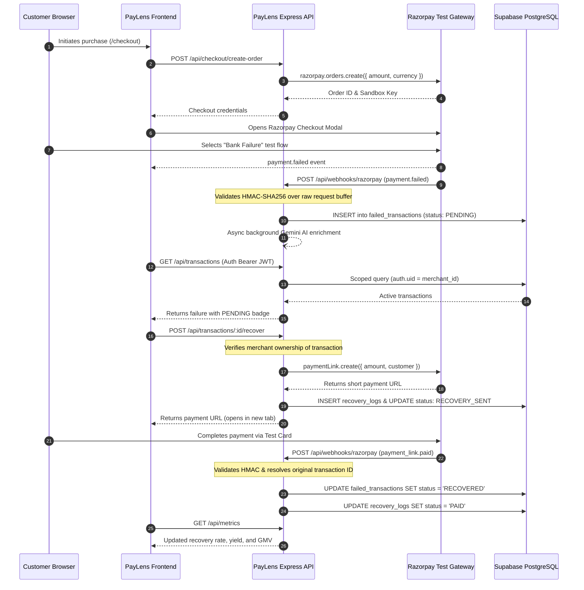
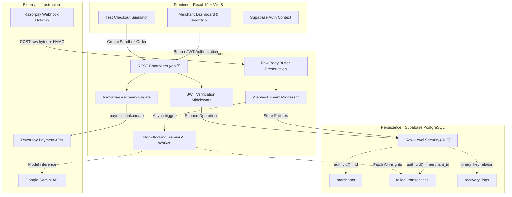

# PayLens

> Real-time payment failure detection, diagnosis, and recovery for Razorpay merchants.

### ▶ Watch the 5-Minute Demo

[**Watch PayLens in action →**](https://drive.google.com/file/d/1BKVlVfzGYM_0q3Hblm59CwPTVFu8VX60/view?usp=sharing)

> **Demo environment:** Razorpay Test Mode only. No real payments are processed.

### Why PayLens?

PayLens helps merchants turn failed payments into recovery opportunities by detecting failures, explaining what happened, providing a recovery path, and confirming when the payment is recovered.

[](https://github.com/fareedvali0708-cmyk/PayLens/actions/workflows/ci.yml)
[](./LICENSE)

```
FAILED PAYMENT → WEBHOOK → DETECTION → DIAGNOSIS → RECOVERY LINK → RETRY → RECOVERED TRANSACTION
```

---

## Navigation

| Resource | Description | Location |
| :--- | :--- | :--- |
| **Architecture** | System design, data flow, and security boundaries | [`docs/architecture.md`](docs/architecture.md) |
| **Demo Flow** | Step-by-step 3–5 minute Test Mode verification walkthrough | [`docs/demo-flow.md`](docs/demo-flow.md) |
| **Testing** | Complete 57-test suite breakdown and verification logs | [`docs/testing.md`](docs/testing.md) |
| **Contributing** | Contributor setup, guidelines, and PR workflow | [`CONTRIBUTING.md`](CONTRIBUTING.md) |
| **Security** | Vulnerability reporting and responsible disclosure | [`SECURITY.md`](SECURITY.md) |

---

## The Problem

Failed transactions represent a significant, unaddressed source of revenue leakage for digital merchants. When a payment fails:
1. **Zero Real-Time Visibility:** Merchants typically learn about payment drop-offs hours or days later through aggregate accounting reports.
2. **Opaque Error Context:** Gateway failure codes (e.g., generic `GATEWAY_ERROR` or `BAD_REQUEST_ERROR`) fail to provide actionable root-cause explanations.
3. **No Direct Recovery Mechanism:** Without automated intervention, customers abandon checkout workflows entirely rather than re-initiating payment.

---

## The Solution

PayLens creates an automated, closed-loop telemetry and recovery pipeline:
- **Instant Webhook Ingestion:** Intercepts Razorpay `payment.failed` webhooks via HMAC-authenticated endpoints within milliseconds.
- **Root-Cause Classification & AI Insights:** Normalizes error codes, maps failure categories (e.g., Bank Downtime, Network Latency, Insufficient Funds), and enriches records via non-blocking Gemini AI analysis.
- **One-Click Omni-Channel Recovery:** Enables merchants to generate and dispatch dedicated Razorpay Payment Links directly to customers.
- **Closed-Loop Reconciliation:** Captures subsequent `payment_link.paid` webhooks, reconciling the original failed record into a `RECOVERED` state and updating recovery metrics in real time.

---

## Verified End-to-End Flow

PayLens has been validated end-to-end using **Razorpay Test Mode** (`rzp_test_*`). *No production funds or live consumer credit cards were used.*

```
Customer Checkout (₹1,499)
  ↓
Razorpay Test Mode Payment Failure
  ↓
Webhook Ingested: payment.failed (HMAC SHA-256 Validated)
  ↓
Record Created: PENDING in Merchant Dashboard
  ↓
Merchant Reviews Error Code & AI Root-Cause Insight
  ↓
Merchant Triggers "Recover Now"
  ↓
Razorpay Payment Link Created via API
  ↓
Customer Completes Payment on Test Rails
  ↓
Webhook Ingested: payment_link.paid
  ↓
Original Transaction Status Updated: RECOVERED
  ↓
Dashboard Metrics Incremented (Recovered Revenue & Yield)
```

---

## Product Proof & Screenshots

The core end-to-end recovery sequence moves an intercepted failure through full financial reconciliation:

```
PENDING ₹1,499 → Recover Now → Razorpay Payment Link → Test Payment Success → SAME Transaction → RECOVERED
```

Standardized showcase screenshots and capture specifications are documented in [`docs/screenshots/README.md`](docs/screenshots/README.md):

| Stage | Visual Specification | Value Delivered |
| :--- | :--- | :--- |
| **01. Authentication** | `01-login.png` | Session authentication via Supabase Auth with JWT bearer scoping. |
| **02. Ingestion** | `02-overview-pending.png` | Real-time capture of Razorpay failure showing amount, timestamp, and customer details. |
| **03. Diagnostics** | `03-diagnostics.png` | Technical error drawer displaying gateway codes and asynchronous Gemini AI remediation tips. |
| **04. Recovery Link** | `04-recovery-link.png` | Server-side Razorpay Payment Link generation with automated attempt tracking. |
| **05. Customer Retry** | `05-razorpay-test-success.png` | Customer-facing payment completion on Razorpay sandbox rails. |
| **06. Reconciliation** | `06-overview-recovered.png` | Reconciled overview table confirming the exact transaction ID marked `RECOVERED`. |

---

## How It Works



---

## Technical Architecture



### Component Responsibilities
- **React 19 Frontend (`client/`):** Responsive dashboard providing live metric visualization, failure inspection, and checkout simulation.
- **Express 5 API (`server/`):** High-throughput REST API managing authentication, rate limiting, and business validation.
- **Supabase PostgreSQL (`supabase/`):** Relational storage enforcing strict multi-tenant data boundaries through Row-Level Security policies.
- **Razorpay SDK & Webhooks:** Real-time payment lifecycle integration handling order generation, event webhooks, and payment links.
- **Google Gemini Service:** Asynchronous worker generating structured merchant recommendations without delaying core payment threads.

*Detailed architectural documentation is available in [`docs/architecture.md`](docs/architecture.md).*

---

## Engineering Highlights

Every security and architectural pattern in PayLens addresses a specific production failure mode:

| Engineering Decision | Production Problem Solved |
| :--- | :--- |
| **Raw Body Buffer Ingestion** | Standard JSON body parsers alter whitespace and key ordering during deserialization, corrupting HMAC calculation. PayLens captures byte-exact buffers via `express.json({ verify })` prior to parsing. |
| **Constant-Time HMAC Verification** | Variable-time string comparisons (`===`) leak timing discrepancies that allow cryptographic oracle attacks. PayLens enforces `crypto.timingSafeEqual` over computed SHA-256 digests. |
| **Multi-Tenant Row-Level Security** | Relying solely on application-level filtering (`WHERE merchant_id = ...`) risks IDOR vulnerabilities from developer error. Supabase RLS policies enforce `auth.uid() = merchant_id` at the database engine level. |
| **Merchant-Scoped Recovery** | Prevents unauthorized actors from triggering payment links or altering recovery status for transactions belonging to other merchants. |
| **Non-Blocking AI Analysis** | Invoking LLM inference directly in webhook handlers causes HTTP connection timeouts and webhook retries from Razorpay. PayLens persists failures immediately and offloads AI enrichment to background workers. |
| **Targeted State Machine Updates** | Webhook reconciliation matches explicit transaction IDs rather than broadcast status updates, preventing race conditions or cross-record corruption. |
| **Strict Origin Allowlisting** | Dynamic CORS middleware limits browser origin access strictly to verified merchant dashboard domains, mitigating CSRF and malicious cross-origin requests. |
| **Authentication Rate Limiting** | `express-rate-limit` enforces threshold bounds on login endpoints, returning `HTTP 429` to defend against credential stuffing. |

---

## Testing & Validation

The PayLens platform has been validated through a 57-test automated verification suite covering security, integration contracts, and business logic:

```
================================================================================
PayLens Comprehensive Test Suite
57 passed, 0 failed (100% pass rate)
================================================================================
```

### Coverage Categories
- **Webhook Security & Scoping:** Raw buffer HMAC integrity, signature rejection, malformed payload handling, and replay prevention.
- **Authentication & Authorization:** JWT validation, unauthorized rejection (401), and permission boundary enforcement.
- **Merchant Isolation (IDOR):** Scoped queries and prevention of cross-merchant data leakage.
- **Recovery State Engine:** State machine progression (`PENDING` &rarr; `RECOVERY_SENT` &rarr; `RECOVERED`) and retry counters.
- **Secret Hygiene:** Verification that server-side credentials and service role keys are never exposed over API contracts.
- **Network & CORS:** Rejection of untrusted origins and validation of security headers via Helmet.
- **AI Fault Tolerance:** Fallback insight delivery during external LLM latency or timeout events.
- **Real Razorpay Test Mode E2E:** Live end-to-end payment failure and recovery executed against real sandbox rails.

*Full test specifications and reproduction commands are documented in [`docs/testing.md`](docs/testing.md).*

---

## Security

PayLens incorporates layered security controls across both application and transport boundaries:

- **Authentication:** Supabase Auth issues cryptographically signed JWTs validated by backend bearer middleware.
- **Data Isolation:** All database reads, updates, and deletes are scoped to the authenticated merchant ID.
- **Webhook Verification:** Signatures are checked against the configured `RAZORPAY_WEBHOOK_SECRET` before processing.
- **Credential Segregation:** Server secrets (`SUPABASE_SERVICE_ROLE_KEY`, `RAZORPAY_KEY_SECRET`, `GEMINI_API_KEY`) remain strictly server-side. The client application utilizes only browser-safe anon credentials.
- **Defense in Depth:** Helmet enforces HTTP security headers (`X-Content-Type-Options: nosniff`, `X-Frame-Options: SAMEORIGIN`, and strict HSTS).

*See [`SECURITY.md`](SECURITY.md) for our vulnerability reporting policy and guidelines.*

---

## Project Structure

```
PayLens/
├── client/                          # React 19 Frontend
│   ├── src/
│   │   ├── components/              # UI widgets, layout elements, and dialogs
│   │   ├── contexts/                # Auth context and session management
│   │   ├── lib/                     # API client abstraction & Supabase client
│   │   └── pages/                   # Application views (Dashboard, Recovery, Checkout)
│   ├── .env.example                 # Browser-safe client environment template
│   └── package.json
├── server/                          # Express 5 Backend API
│   ├── src/
│   │   ├── config/                  # Supabase & Razorpay client initialization
│   │   ├── middleware/              # Auth JWT, rate limiters, raw body HMAC
│   │   ├── routes/                  # API routers (webhooks, recovery, checkout, metrics)
│   │   ├── services/                # Gemini AI background enrichment worker
│   │   └── utils/                   # Failure categorization & normalization
│   ├── supabase/migrations/         # PostgreSQL schema & Row-Level Security policies
│   ├── test_*.js                    # Integration, security, and webhook regression tests
│   ├── .env.example                 # Backend environment variable template
│   └── package.json
├── docs/                            # Deep-dive engineering documentation
│   ├── architecture.md              # Detailed architectural design & boundaries
│   ├── demo-flow.md                 # 3-5 minute step-by-step verification guide
│   ├── testing.md                   # Automated testing suite and results breakdown
│   └── screenshots/                 # Showcase assets and README specifications
├── .github/workflows/ci.yml         # GitHub Actions workflow (lint & build validation)
├── CONTRIBUTING.md                  # Development guidelines and PR checklist
├── LICENSE                          # MIT License
├── SECURITY.md                      # Security disclosure guidelines
└── README.md                        # Project showcase documentation
```

---

## Quick Start

### Prerequisites
- **Node.js**: v20.x or higher
- **npm**: v10.x or higher
- **Razorpay Account**: Access to [Razorpay Dashboard](https://dashboard.razorpay.com) in Test Mode
- **Supabase Project**: Free-tier project with PostgreSQL database access
- **Tunnel Utility**: `ngrok`, `zrok`, or `localtunnel` (for routing Razorpay webhooks to localhost)

### 1. Clone & Install Dependencies
```bash
git clone https://github.com/fareedvali0708-cmyk/PayLens.git
cd PayLens

# Install frontend dependencies
cd client && npm install && cd ..

# Install backend dependencies
cd server && npm install && cd ..
```

### 2. Configure Environment Variables
Copy the provided templates and supply your sandbox credentials:

```bash
# Frontend environment
cp client/.env.example client/.env

# Backend environment
cp server/.env.example server/.env
```

*Refer to `client/.env.example` and `server/.env.example` for required configuration variables.*

### 3. Initialize Database Schema
Execute the SQL migration located at `server/supabase/migrations/001_initial_schema.sql` inside your Supabase project SQL Editor to instantiate required tables, foreign keys, and RLS policies.

### 4. Start Development Servers
```bash
# Terminal 1: Start Express API (Port 3001)
cd server
npm run dev

# Terminal 2: Start React Frontend (Port 5173)
cd client
npm run dev
```

### 5. Configure Razorpay Webhook Tunnel
Expose local port `3001` via your chosen tunneling tool:
```bash
# Example with ngrok
ngrok http 3001
```
In your Razorpay Dashboard (**Settings &rarr; Webhooks &rarr; Add New Webhook**):
- **Webhook URL**: `https://<your-tunnel-url>/api/webhooks/razorpay`
- **Secret**: Set to match `RAZORPAY_WEBHOOK_SECRET` in `server/.env`
- **Active Events**: `payment.failed`, `payment_link.paid`

Open `http://localhost:5173` to access the application.

---

## Demo Walkthrough

A complete demonstration of the payment interception and recovery loop requires approximately 3 to 5 minutes:

1. **Simulate Purchase:** Visit `/checkout` and initiate a test order of ₹1,499.
2. **Trigger Bank Decline:** Select any payment method in the Razorpay Test Modal and click **Failed** on the simulation screen.
3. **Inspect Real-Time Interception:** Open the **Overview Dashboard** (`/app/overview`) to view the newly captured transaction with a `PENDING` status.
4. **Review Diagnostics:** Click **View** to inspect the root cause, gateway error codes, and Gemini AI coaching insights.
5. **Issue Recovery:** Click **Recover Now** to generate a Razorpay Payment Link.
6. **Execute Customer Recovery:** Complete payment via the opened payment link using Razorpay test credentials.
7. **Reconciliation:** Return to the dashboard to verify that the transaction transitions to `RECOVERED` and recovery yield metrics update automatically.

*For detailed reproduction steps, see [`docs/demo-flow.md`](docs/demo-flow.md).*

---

## Limitations & Future Scope

### Current Implementation Scope
- **Test Mode Operation:** Designed and validated exclusively against Razorpay Sandbox APIs.
- **Payment Link Recovery:** Automated recovery currently delivers payment opportunities via direct Razorpay Payment Links.
- **Sandbox Link Quota:** Razorpay Test Mode imposes a quota of 30 concurrent active payment links per sandbox account.

### Future Scope
- **Omni-Channel Dispatch:** Direct integration with WhatsApp Business API and transactional SMS gateways (Twilio / Gupshup).
- **Automated Retry Rules:** Configurable recovery policies based on failure category (e.g., immediate retry for network drops vs. delayed nudge for daily limit breaches).
- **Smart Routing Recommendations:** AI-driven checkout payment method re-ordering based on real-time issuing bank health telemetry.

---

## What This Project Demonstrates

This project provides concrete evidence of full-stack engineering proficiency across core domains:

- **Payment System Integration:** Deep understanding of order creation lifecycles, webhook event handling, and payment link generation.
- **Defensive Backend Architecture:** Implementation of raw buffer cryptographic validation, constant-time comparisons, rate limiting, and structured error boundaries.
- **Multi-Tenant Data Modeling:** Database schema design utilizing PostgreSQL Row-Level Security for isolation.
- **Asynchronous Processing:** Decoupling high-frequency payment webhooks from long-running LLM inference workflows.
- **Automated Verification:** Comprehensive test automation spanning unit contracts, security regression suites, and live third-party API flows.
- **Clear Technical Communication:** Architecture documentation, reproducible demo protocols, and standardized open-source repository structure.

---

## Contributing

Contributions, bug reports, and suggestions are welcome. Please review [`CONTRIBUTING.md`](CONTRIBUTING.md) for branch workflows, linting requirements, and testing expectations before submitting a pull request.

---

## License

This project is open source and available under the terms of the [MIT License](LICENSE).
