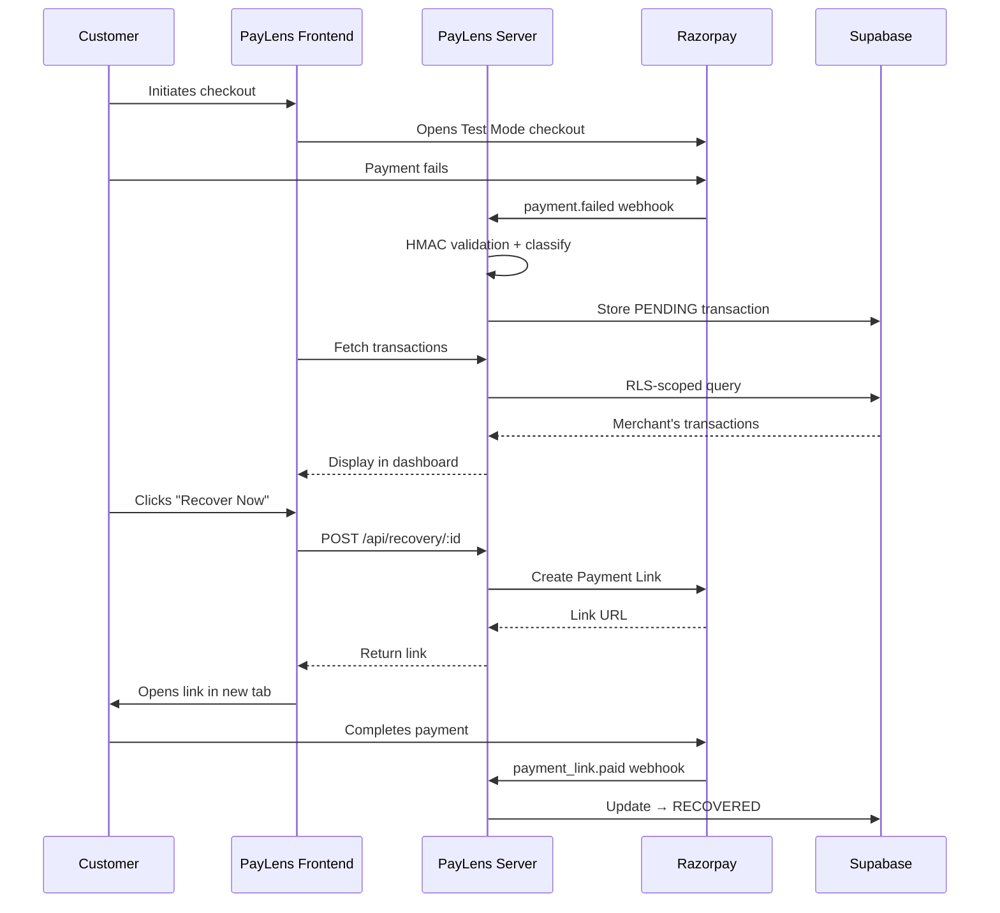
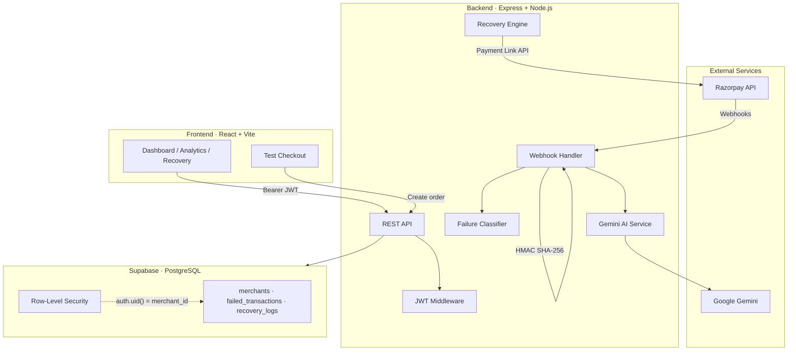

# PayLens

[](https://github.com/fareedvali/PayLens/actions/workflows/ci.yml)
[](./LICENSE)

**Real-time payment failure detection, diagnosis, and recovery for Razorpay merchants.**

---

## Why PayLens?

Failed payments are invisible revenue leaks. Most merchants discover them too late, have no idea *why* they failed, and lack the tooling to recover them efficiently.

**PayLens solves this** by intercepting Razorpay payment failures in real time via webhooks, classifying the root cause, surfacing AI-powered diagnostics, and enabling one-click recovery through Razorpay Payment Links — all from a single dashboard.

This is a production-style fintech application built and tested entirely in **Razorpay Test Mode**.

---

## How PayLens Works

```
Customer Checkout
  → Razorpay Test Mode Payment
  → Payment Fails
  → payment.failed Webhook
  → HMAC Signature Validation
  → Failure Classification
  → AI Insight Generation (Gemini)
  → Transaction Stored as PENDING
  → Merchant Dashboard Detection
  → Diagnostics & Root Cause
  → "Recover Now" → Razorpay Payment Link
  → Customer Retries Payment
  → payment_link.paid Webhook
  → Transaction Status → RECOVERED
  → Dashboard Metrics Updated
```



For the complete step-by-step walkthrough, see [`docs/demo-flow.md`](docs/demo-flow.md).

---

## Screenshots

> Screenshots should be placed in `docs/screenshots/`. The following are recommended:

| Screenshot | Description |
|------------|-------------|
| `login.png` | Login page |
| `overview-pending.png` | Overview dashboard with a PENDING transaction |
| `diagnostics.png` | Transaction diagnostics drawer with AI insight |
| `recovery-link.png` | Recovery link generation |
| `overview-recovered.png` | Dashboard after successful recovery |
| `analytics.png` | Analytics page with recovery metrics |

Once added, embed them here:

```


```

---

## Architecture



Full architecture documentation: [`docs/architecture.md`](docs/architecture.md)

---

## Security

All security controls listed below are **implemented and verified** in the codebase:

| Control | Implementation |
|---------|---------------|
| Webhook authentication | HMAC SHA-256 with `crypto.timingSafeEqual` |
| Raw body preservation | `express.json({ verify })` stores raw bytes for HMAC |
| JWT authentication | Bearer tokens validated on all protected endpoints |
| Merchant isolation | Supabase RLS policies enforce `auth.uid() = merchant_id` |
| IDOR prevention | Server-side merchant scoping on all data queries |
| CORS | Origin allowlist; rejects unknown origins |
| Rate limiting | `express-rate-limit` on authentication endpoints |
| Security headers | Helmet middleware on all responses |
| Secret storage | All credentials in server-side `.env`; never exposed to client |

---

## Testing & Validation

| Metric | Value |
|--------|-------|
| Total tests | 57 |
| Passed | 57 |
| Failed | 0 |

### Test Coverage

| Category | What is tested |
|----------|---------------|
| Authentication | JWT enforcement, 401 on missing/invalid tokens |
| Authorization | Merchant data isolation, IDOR prevention |
| Webhook security | HMAC validation, timing-safe comparison, invalid signature rejection |
| Recovery flow | Payment Link creation, state transitions, attempt tracking |
| API contracts | Endpoint response formats, error handling |
| Secret exposure | No credentials in API responses |
| AI integration | Gemini connectivity, graceful fallback |

### End-to-End Verification

The complete Razorpay Test Mode flow has been verified:
- `payment.failed` → detection → classification → dashboard → recovery → `payment_link.paid` → `RECOVERED`

**Production payments were NOT used.** All testing was performed exclusively in Razorpay Test Mode.

Test details: [`docs/testing.md`](docs/testing.md)

---

## Tech Stack

| Layer | Technology |
|-------|-----------|
| Frontend | React 19, Vite 8, TailwindCSS 4, React Router 7 |
| Backend | Node.js, Express 5, Zod (validation) |
| Database | Supabase (PostgreSQL) with Row-Level Security |
| Payments | Razorpay SDK (Test Mode) |
| AI | Google Gemini (`@google/genai`) |
| Security | Helmet, CORS, express-rate-limit, crypto (HMAC) |
| Auth | Supabase Auth (JWT) |

---

## Quick Start

### Prerequisites
- Node.js 20+
- npm
- A [Razorpay](https://razorpay.com) account (Test Mode keys)
- A [Supabase](https://supabase.com) project
- (Optional) A [Google AI](https://ai.google.dev/) API key for Gemini

### Setup

```bash
# Clone
git clone https://github.com/fareedvali/PayLens.git
cd PayLens

# Install dependencies
cd client && npm install && cd ..
cd server && npm install && cd ..

# Configure environment
cp client/.env.example client/.env
cp server/.env.example server/.env
# Edit both .env files with your credentials

# Apply database schema
# Run server/supabase/migrations/001_initial_schema.sql in your Supabase SQL editor

# Start development servers
# Terminal 1: Client
cd client && npm run dev

# Terminal 2: Server
cd server && npm run dev
```

Open `http://localhost:5173` in your browser.

### Webhook Setup (for local development)

Razorpay webhooks need a public URL. Use a tunnel:

```bash
# Example with ngrok
ngrok http 3001

# Configure the forwarding URL in Razorpay Dashboard → Webhooks:
# https://your-tunnel-url.ngrok.io/api/webhooks/razorpay
```

---

## Environment Variables

### Client (`client/.env`)

| Variable | Description |
|----------|-------------|
| `VITE_SUPABASE_URL` | Supabase project URL |
| `VITE_SUPABASE_ANON_KEY` | Supabase anonymous/public key |
| `VITE_API_BASE_URL` | Backend API URL (default: `http://localhost:3001/api`) |

### Server (`server/.env`)

| Variable | Description |
|----------|-------------|
| `PORT` | Server port (default: `3001`) |
| `SUPABASE_URL` | Supabase project URL |
| `SUPABASE_SERVICE_ROLE_KEY` | Supabase service role key (server-side only) |
| `DEFAULT_MERCHANT_ID` | Default merchant UUID for test operations |
| `CORS_ORIGIN` | Allowed CORS origins (comma-separated) |
| `RAZORPAY_KEY_ID` | Razorpay Test Mode key ID |
| `RAZORPAY_KEY_SECRET` | Razorpay Test Mode key secret |
| `RAZORPAY_WEBHOOK_SECRET` | Razorpay webhook signing secret |
| `GEMINI_API_KEY` | Google Gemini API key |

---

## Project Structure

```
PayLens/
├── client/                          # React frontend
│   ├── src/
│   │   ├── components/
│   │   │   ├── dashboard/           # Dashboard widgets (KPI, tables, diagnostics)
│   │   │   ├── ui/                  # Reusable UI components
│   │   │   ├── Sidebar.jsx
│   │   │   └── AppLayout.jsx
│   │   ├── contexts/                # Auth context
│   │   ├── lib/                     # API client, Supabase config
│   │   └── pages/                   # Route pages (Login, Dashboard, Recovery, etc.)
│   ├── public/
│   └── .env.example
├── server/                          # Express backend
│   ├── src/
│   │   ├── config/                  # Supabase client init
│   │   ├── middleware/              # Auth, rate limiter, error handler
│   │   ├── routes/                  # API routes
│   │   │   ├── webhooks.js          # Razorpay webhook handler
│   │   │   ├── recovery.js          # Recovery + Payment Link creation
│   │   │   ├── checkout.js          # Order creation
│   │   │   ├── metrics.js           # Analytics data
│   │   │   ├── settings.js          # Merchant settings
│   │   │   └── auth.js              # Authentication
│   │   ├── services/                # Gemini AI service
│   │   ├── schemas/                 # Zod validation schemas
│   │   └── utils/                   # Failure classifier
│   ├── supabase/migrations/         # SQL schema
│   ├── test_*.js                    # Test files
│   └── .env.example
├── docs/
│   ├── architecture.md
│   ├── demo-flow.md
│   ├── testing.md
│   └── screenshots/
├── .github/workflows/ci.yml
├── .gitignore
├── CONTRIBUTING.md
├── LICENSE
└── README.md
```

---

## Limitations & Future Scope

### Current Limitations
- Operates in **Razorpay Test Mode only**; not configured for production payments
- AI insights depend on Gemini API availability
- No automated E2E test suite (tests require live Supabase/Razorpay credentials)
- Single-tenant default merchant for demo purposes

### Planned Improvements
- Production Razorpay integration with compliance checks
- Multi-tenant onboarding flow
- Automated recovery scheduling (batch recovery)
- SMS/email notification channels for customers
- Advanced analytics with trend detection
- Mobile-responsive design improvements

---

## Contributing

See [`CONTRIBUTING.md`](CONTRIBUTING.md) for guidelines.

---

## License

MIT — see [`LICENSE`](LICENSE) for details.
