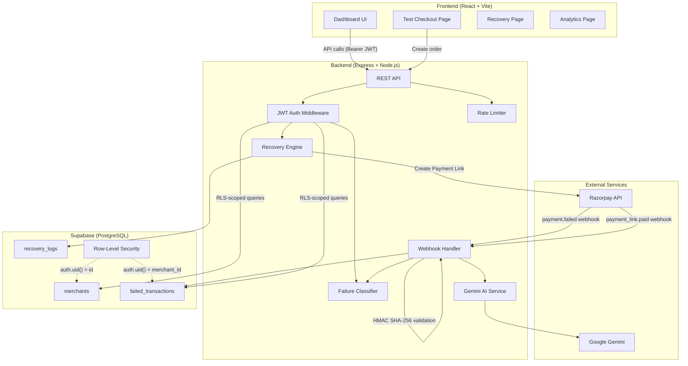

# Architecture Overview

## System Diagram

## Component Breakdown

### Frontend
- **React 19** with **Vite** for fast HMR
- **TailwindCSS** for styling
- **React Router** for client-side routing
- **Supabase JS** for authentication

### Backend
- **Express 5** REST API
- **Helmet** for HTTP security headers
- **CORS** with origin allowlisting
- **Rate limiting** on sensitive endpoints
- **Raw body preservation** for webhook HMAC verification

### Database
- **Supabase** (hosted PostgreSQL)
- **Row-Level Security (RLS)** on all tables
- Policies enforce `auth.uid() = merchant_id` on every query
- Three core tables: `merchants`, `failed_transactions`, `recovery_logs`

### External Integrations
- **Razorpay SDK** — order creation, Payment Link generation, webhook ingestion
- **Google Gemini** — AI-powered failure analysis and merchant-facing insights

### Security Layers
1. JWT authentication on all protected endpoints
2. HMAC SHA-256 webhook signature validation with `crypto.timingSafeEqual`
3. Supabase RLS policies for merchant data isolation
4. Helmet security headers
5. CORS origin allowlisting
6. Rate limiting on auth endpoints
7. Server-side secret storage (no secrets exposed to client)
