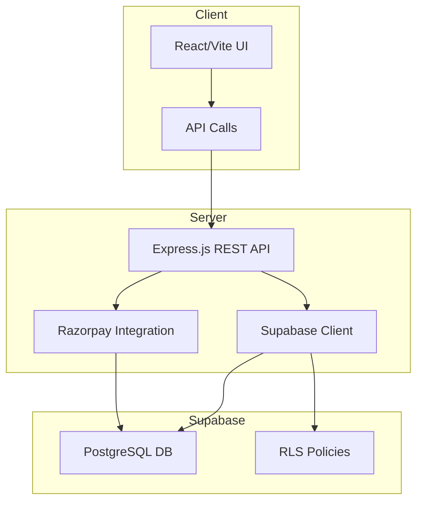

# Architecture Overview

The **Client** (React/Vite) communicates with the **Server** via REST endpoints. The server handles Razorpay webhooks, creates payment links, and accesses Supabase for data storage with row‑level security (RLS). All secrets are kept on the server side.
