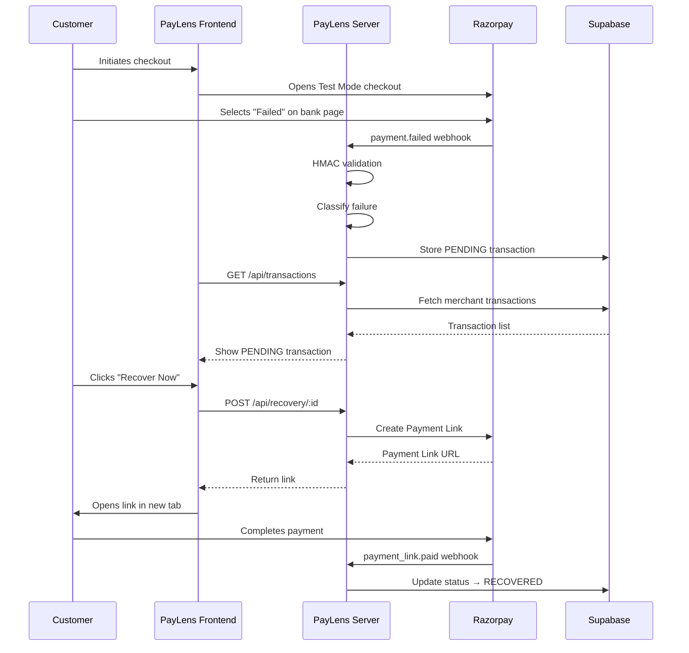

# Demo Flow — Razorpay Test Mode

This document describes the verified end-to-end PayLens demo flow using Razorpay Test Mode. No production payments are involved.

## Prerequisites

- PayLens client and server running locally
- Razorpay Test Mode API keys configured
- Supabase project with the initial schema applied
- Razorpay webhook endpoint configured (use a tunnel like ngrok/zrok for local development)

## Step-by-Step Flow

### 1. Login
Open `http://localhost:5173/login` and authenticate with a registered merchant account.

### 2. Initiate a Test Checkout
Navigate to the **Checkout** page. Enter a test amount and customer details. The Razorpay checkout modal opens in Test Mode.

### 3. Simulate a Payment Failure
In the Razorpay Test Mode checkout modal, select any payment method and click **Pay**. When the bank simulation page appears, choose **Failed** to intentionally fail the payment.

### 4. Webhook Ingestion
Razorpay sends a `payment.failed` webhook to the PayLens server endpoint:
```
POST /api/webhooks/razorpay
```
The server:
1. Validates the HMAC SHA-256 signature using `crypto.timingSafeEqual`
2. Classifies the failure reason using the built-in failure classifier
3. Enriches the transaction with AI-powered insights (Gemini)
4. Stores the transaction in Supabase with status `PENDING`

### 5. Dashboard Detection
Navigate to the **Overview** page. The failed transaction appears in the dashboard table with:
- Transaction ID
- Amount
- Error code and description
- Failure classification
- `PENDING` status badge

### 6. Diagnostics
Click the **View** button on any transaction to open the diagnostics drawer. This shows:
- Root cause analysis
- AI-generated insight
- Error metadata
- Recovery options

### 7. Recovery
Click **Recover Now**. The backend:
1. Creates a Razorpay Payment Link via the Razorpay API
2. Returns the link URL to the frontend
3. The frontend opens the link in a new browser tab

### 8. Customer Completes Payment
In the new tab, the customer sees the Razorpay Payment Link page. Complete the payment using Razorpay Test Mode credentials:
- **Card**: `4111 1111 1111 1111` (any future expiry, any CVV)
- **UPI**: `success@razorpay`

### 9. Recovery Webhook
Razorpay sends a `payment_link.paid` webhook. The server:
1. Validates the HMAC signature
2. Matches the payment link to the original failed transaction
3. Updates the transaction status from `PENDING` to `RECOVERED`

### 10. Verification
Return to the **Overview** dashboard. The transaction now shows a `RECOVERED` status badge. Analytics metrics reflect the successful recovery.

## Flow Diagram


